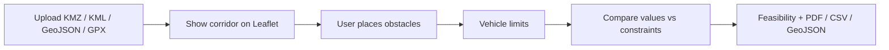

# Route Analysis Toolkit

Python + Leaflet Web GIS toolkit for analyzing oversized transport corridors.

**Workflow:** upload a real route (My Maps **KMZ**/KML · GeoJSON · GPX) → mark obstacles on the map → compare against vehicle limits → export PDF / CSV / GeoJSON.

Includes a built-in sample: **Montpellier → Lyon** (KMZ).

> Not for certified operational transport planning.


## Features

- **Upload route** — GeoJSON, KML, **KMZ**, GPX
- **Obstacle annotation** — low bridge, narrow road, weight limit, steep slope, notes
- **Vehicle constraints** — length / width / height / weight / max slope
- **Automatic feasibility report** — conflict vs caution vs ok
- **Exports** — GeoJSON · CSV · PDF
- **Sample corridor** — Montpellier → Lyon KMZ with example obstacles

## Technologies

| Layer | Stack |
|-------|--------|
| Backend | Python, FastAPI, Shapely, NumPy, ReportLab |
| Frontend | Leaflet, vanilla JS |
| Sample | `backend/data/sample_montpellier_lyon.kmz` |

## Quick start

```bash
git clone https://github.com/GeoByteBrew/Route_Analysis_Toolkit.git
cd Route_Analysis_Toolkit

python3 -m venv .venv
source .venv/bin/activate   # Windows: .venv\Scripts\activate

pip install -r requirements.txt
uvicorn backend.app:app --reload --host 127.0.0.1 --port 8000
```

Open [http://127.0.0.1:8000](http://127.0.0.1:8000)

### Try it

1. App loads **Montpellier → Lyon** sample KMZ with example obstacles
2. Or upload your own **KMZ / KML / GeoJSON / GPX**
3. Click **Click map to place obstacle**, set type/value, click the route
4. Adjust vehicle limits → **Run Analysis**
5. Download **GeoJSON / CSV / PDF**

## Example API

### Sample route

```bash
curl -s http://127.0.0.1:8000/api/sample/route | python3 -m json.tool
```

### Upload a KMZ

```bash
curl -s -X POST http://127.0.0.1:8000/api/upload/route \
  -F "file=@backend/data/sample_montpellier_lyon.kmz" | python3 -m json.tool
```

### Analyze route + obstacles

```bash
curl -s -X POST http://127.0.0.1:8000/api/analyze \
  -H 'Content-Type: application/json' \
  -d @- <<'EOF' | python3 -m json.tool
{
  "route": {
    "type": "Feature",
    "properties": {"name": "demo"},
    "geometry": {
      "type": "LineString",
      "coordinates": [[3.87613,43.61087],[4.80729,44.54327],[4.8355,45.76412]]
    }
  },
  "obstacles": [
    {"name": "Low bridge", "type": "low_bridge", "value": 3.7, "lon": 4.62745, "lat": 43.95685}
  ],
  "vehicle": {
    "length_m": 45, "width_m": 4.5, "height_m": 4.2,
    "weight_t": 80, "max_slope_pct": 8
  }
}
EOF
```

### Key endpoints

| Method | Path | Description |
|--------|------|-------------|
| `GET` | `/api/health` | Health check |
| `GET` | `/api/meta` | App metadata |
| `GET` | `/api/sample/route` | Montpellier → Lyon sample + obstacles |
| `POST` | `/api/upload/route` | Parse GeoJSON / KML / KMZ / GPX |
| `POST` | `/api/analyze` | Route + obstacles analysis |
| `GET` | `/api/exports/{file}` | Download generated report |

## How analysis works



| Obstacle type | Conflict when |
|---------------|---------------|
| Low bridge | clearance &lt; vehicle height |
| Narrow road | width &lt; vehicle width |
| Weight limit | limit &lt; vehicle weight |
| Steep slope | slope &gt; vehicle max slope |
| Note | always caution if on corridor |

## Project layout

```
Route_Analysis_Toolkit/
├── backend/
│   ├── app.py
│   ├── data/
│   │   ├── sample_montpellier_lyon.kmz
│   │   └── sample_obstacles.json
│   └── services/
│       ├── parse_route.py
│       ├── custom_analyze.py
│       ├── vehicle.py
│       └── report.py
├── frontend/
├── scripts/run.sh
└── outputs/
```

## License

MIT — see [LICENSE](LICENSE).
