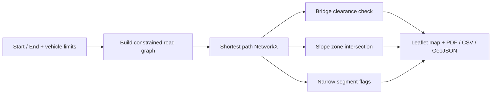

# Wind Route Analysis Toolkit

Python + Leaflet Web GIS toolkit for analyzing transportation routes of oversized wind turbine components against bridge clearance, road width, and terrain slope — using open sample geospatial data for **Hérault** (Occitanie, France).

> Demo region centered on Montpellier. Synthetic sample network for education and portfolio use — **not** for operational transport planning.


## Features

- **Interactive Web Map** — Leaflet UI: click start / destination, run analysis in the browser
- **Route Analysis** — shortest feasible path on a constrained road graph (NetworkX)
- **Bridge Clearance Check** — flag overpasses below vehicle height
- **Narrow Road Detection** — highlight tight segments relative to vehicle width
- **Slope Analysis** — intersect route with steep terrain hazard zones
- **Exports** — GeoJSON · CSV · PDF report

## Technologies

| Layer | Stack |
|-------|--------|
| Backend | Python, FastAPI, GeoPandas, Shapely, NetworkX, Pandas, ReportLab |
| Frontend | Leaflet, vanilla JS |
| Data | GeoJSON sample layers for Hérault |

## Quick start

```bash
git clone https://github.com/<you>/wind-route-analysis-toolkit.git
cd wind-route-analysis-toolkit

python3 -m venv .venv
source .venv/bin/activate   # Windows: .venv\Scripts\activate

pip install -r requirements.txt
python scripts/generate_sample_data.py

uvicorn backend.app:app --reload --host 127.0.0.1 --port 8000
```

Open [http://127.0.0.1:8000](http://127.0.0.1:8000)

### Try the demo

1. Default points load as **Montpellier → Béziers**
2. Adjust vehicle limits (length / width / height / weight / max slope)
3. Click **Run Analysis**
4. Inspect route, low bridges, steep zones
5. Download **GeoJSON / CSV / PDF**

Or pick new points: **Select Start** → click map → **Select Destination** → **Run Analysis**.

## Example API

```bash
curl -s -X POST http://127.0.0.1:8000/api/analyze \
  -H 'Content-Type: application/json' \
  -d '{
    "start": {"lon": 3.8767, "lat": 43.6108},
    "end":   {"lon": 3.2158, "lat": 43.3442},
    "vehicle": {
      "length_m": 45,
      "width_m": 4.5,
      "height_m": 4.2,
      "weight_t": 80,
      "max_slope_pct": 8
    }
  }' | python3 -m json.tool
```

### Key endpoints

| Method | Path | Description |
|--------|------|-------------|
| `GET` | `/api/health` | Health check |
| `GET` | `/api/meta` | Region metadata |
| `GET` | `/api/layers/roads` | Sample road network |
| `GET` | `/api/layers/bridges` | Sample bridges |
| `GET` | `/api/layers/slopes` | Steep slope zones |
| `POST` | `/api/analyze` | Full route + constraints analysis |
| `GET` | `/api/exports/{file}` | Download generated report |

## Project layout

```
wind-route-analysis-toolkit/
├── README.md
├── LICENSE
├── requirements.txt
├── backend/
│   ├── app.py                 # FastAPI entry
│   ├── data/                  # roads, bridges, slopes, places (GeoJSON)
│   └── services/
│       ├── route.py
│       ├── bridges.py
│       ├── slope.py
│       └── report.py
├── frontend/
│   ├── index.html
│   ├── css/style.css
│   └── js/{map.js,app.js}
├── scripts/
│   └── generate_sample_data.py
├── notebooks/
├── images/
└── outputs/
```

## How analysis works



1. Roads narrower than vehicle **width**, or steeper than **max slope**, are removed from the graph.
2. Remaining edges are costed by length with soft penalties for tighter / steeper roads.
3. Bridges within a corridor of the path are compared to vehicle **height**.
4. Slope polygons intersecting the path are flagged if above the vehicle slope limit.

## Sample data

Generated by `scripts/generate_sample_data.py` for towns across Hérault (Montpellier, Béziers, Sète, Lodève, …):

| File | Contents |
|------|----------|
| `backend/data/roads.geojson` | Connected inter-town road segments with width & slope |
| `backend/data/bridges.geojson` | Bridge / overpass clearances |
| `backend/data/slope_zones.geojson` | Steep terrain hazard polygons |
| `backend/data/places.geojson` | Place labels |

Regenerate anytime:

```bash
python scripts/generate_sample_data.py
```

## What this is / isn’t

| Is | Isn’t |
|----|-------|
| Portfolio-ready Web GIS demo | Production routing engine |
| Transparent constraint workflow | Live OSM / traffic feed |
| Reproducible sample Hérault region | Certified clearance database |

Future ideas: real OSMnx extract for Hérault, weight-restricted edges, alternative corridors, Türkiye region pack.

## License

MIT — see [LICENSE](LICENSE).
